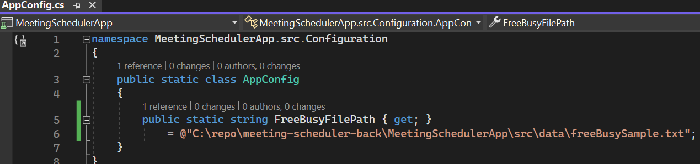
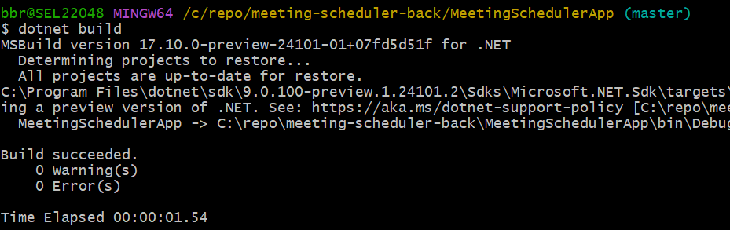
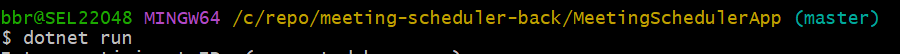
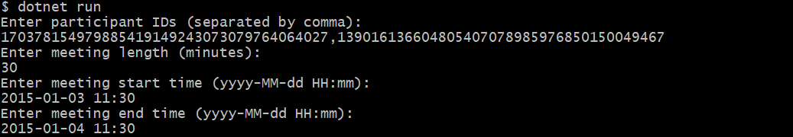
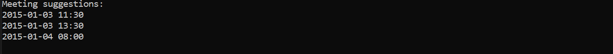

#  Meeting Scheduler Application

This is a .NET console application developed to assist with scheduling meetings by suggesting suitable meeting times based on specified parameters.

## Features

- **Meeting Time Suggestions**: The application provides three meeting time suggestions based on specified participant IDs, desired meeting length, and requested meeting date and time.
- **Participant Availability**: It considers participants' existing busy slots to ensure suggested meeting times do not conflict with their schedules.
- **Office Hours Compliance**: The application respects office hours, ensuring suggested meeting times fall within specified working hours.
- **Robust Input Validation**: Input parameters are validated to ensure they meet expected formats and constraints, preventing erroneous input.
- **Scalability and Flexibility**: The application is designed with modularity and extensibility in mind, allowing for easy integration with other systems or expansion of functionality.

- **Code Quality and Design**: Emphasis is placed on clean code principles, including KISS (Keep It Simple, Stupid) and DRY (Don't Repeat Yourself). The codebase is designed to be easy to understand, maintain, and extend. Methods are implemented with the Single Responsibility Principle in mind to ensure they have a single reason to change and are considered to avoid unnecessary or over-engineering.

## Architecture

The Meeting Scheduler Application follows a modular architecture with clear separation of concerns. It consists of the following components:

- **Configuration**: Contains application configuration setting, including file path.
- **Models**: Defines the data structures used to represent employees and their busy slots.
- **Services**: Implements the core logic of the application, including meeting scheduling functionality.
- **Utility**: Provides utility functions for input validation and file parsing.
- **Runner**: Acts as the entry point for the application, handling user input and coordinating interactions with other components.

## Methods
The application includes the following key methods:

- **ProvideMeetingTimeSuggestions**: Provides three meeting time suggestions based on specified parameters, such as participant IDs, meeting length, and requested meeting date and time.

- **LoadEmployees**: Parses employee data from the input file and returns a list of employee objects with there employeeId, displayName and busySlots.

## Test Coverage
The application includes unit tests to verify the correctness of its functionalities. Test coverage ensures that critical parts of the codebase are thoroughly tested, reducing the likelihood of bugs and regressions.

The test is covered by using a sample freebusy file that has a few lines of content. The content of this sample file is included under Configuration section. The general logic is also expected to work for the provided text file, freebusy.

Input validation, including possible exceptions, is also tested. The content of this sample file is included at the end of this page.

## Installation and Usage

1. **Unzip the Application**: Unzip the console application. For window machine as a sample place it @ /c/repo.

2. **Configure freeBusySample text file path under AppConfig.cs file**
The application's configuration settings are stored in the AppConfig.cs file within the Configuration namespace. You can adjust file path constant as needed in this file. 

    The freeBusySample text file has the following content:

   170378154979885419149243073079764064027;Colin Gomez 
   170378154979885419149243073079764064027;1/3/2015 2:00:00 PM;1/3/2015 5:00:00 PM;485D2AEB9DBE3... 
   170378154979885419149243073079764064027;1/3/2015 12:00:00 PM;1/3/2015 1:30:00 PM;485D2AEB9DBE4... 
   139016136604805407078985976850150049467;Minnie Callahan 
   139016136604805407078985976850150049467;1/3/2015 11:00:00 AM;1/3/2015 11:30:00 AM;C165039FC08444... 

    Here is the file path  value after unziping the application @ /c/repo at window machine.

    @"C:\repo\meeting-scheduler-back\MeetingSchedulerApp\src\data\freeBusySample.txt";

    

3. **Navigate to the Project Directory**: Change to project directory path.  

   

4. **Build the Application**: Open a command prompt or terminal window and run the command dotnet build to build the application.

    

5. **Run the Application**: After building the application, run the command dotnet run.
    
    

6. **Follow On-screen Instructions**: Input participant IDs, meeting length, meeting start time, and meeting end time when prompted.

    

7. **View Meeting Suggestions**: The application will suggest three meeting times based on the provided parameters. For testing purpose a text file named freeBusySample is used and which has few lines of content but similar format with the provided freeBusy text file. freeBusySample content is shown under configuration section of this file.

    
